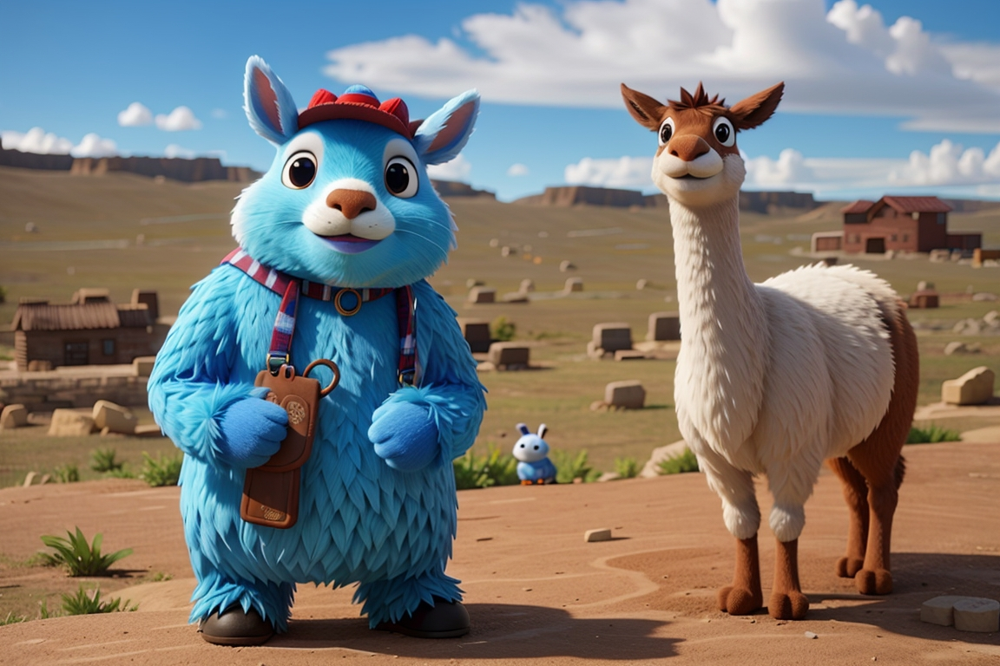
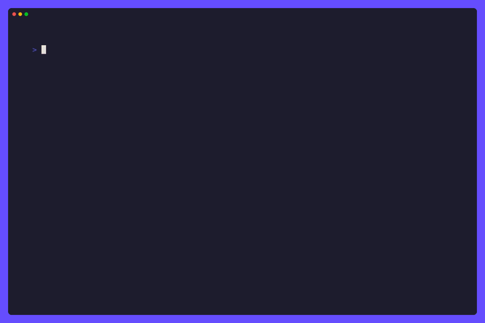

# 🤖 Gollama: Ollama in your terminal, Your Offline AI Copilot 🦙

Gollama is a delightful tool that brings [Ollama](https://ollama.com/), your offline conversational AI companion, directly into your terminal. It provides a fun and interactive way to generate responses from various models without needing internet connectivity. Whether you're brainstorming ideas, exploring creative writing, or just looking for inspiration, Gollama is here to assist you.



## 🌟 Features

- **Interactive Interface**: Enjoy a seamless user experience with intuitive interface powered by [Bubble Tea](https://github.com/charmbracelet/bubbletea).
- **Customizable Prompts**: Tailor your prompts to get precisely the responses you need.
- **Multiple Models**: Choose from a variety of models to generate responses that suit your requirements.
- **Visual Feedback**: Stay engaged with visual cues like spinners and formatted output.

## 🚀 Getting Started

### Prerequisites

- [Go](https://go.dev/) installed on your system.
- [Ollama](https://ollama.com/) installed on your system or a gollama API server accessible from your machine. (Default: `http://localhost:11434`) Read more about customizing the base URL [here](#options).
- Atleast one model installed on your Ollama server. You can install models using the `ollama pull <model-name>` command. To find a list of all available models, check the [Ollama Library](https://ollama.com/library/). You can also use the `ollama list` command to list all locally installed models.

### Installation

You can install Gollama using one of the following methods:

#### Download the latest release

Grab the latest release from the [releases page](https://github.com/Gaurav-Gosain/gollama/releases) and extract the archive to a location of your choice.

#### Install using Go

You can also install Gollama using the `go install` command:

```bash
go install github.com/gaurav-gosain/gollama@latest
```

#### Run using Docker

You can also run gollama using docker:

1. Clone the repository:

```bash
git clone https://github.com/Gaurav-Gosain/gollama.git
```
2. Navigate to the project directory:

```bash
cd gollama
```
3. Build the docker image:

```bash
docker build -t gollama .
```
4. Run the docker image:

```bash
docker run --net=host -it gollama
```

#### Build from source

If you prefer to build from source, follow these steps:

1. Clone the repository:

```bash
git clone https://github.com/Gaurav-Gosain/gollama.git
```

2. Navigate to the project directory:

```bash
cd gollama
```

3. Build the executable:

```bash
go build
```

### Usage

1. Run the executable:

```bash
gollama
```
or 

```bash
/path/to/gollama
```

2. Follow the on-screen instructions to interact with Gollama.

### Options

- `--help`: Display the help message.
- `--base-url`: Specify a custom base URL for the Ollama server.
- `--prompt`: Specify a custom prompt for generating responses.
- `--model`: Choose a specific model for response generation.
  > List of available ollama models can be found using the `ollama list` command.
- `--raw`: Enable raw output mode for unformatted responses.

> [!NOTE]
> The following options for multimodal models are also available, but are expermintal and may not work as expected

> [!WARNING] 
> The responses for multimodal llms are slower than the normal models (also depends on the size of the attached image)

- `--attach-image`: Allow attaching an image to the prompt.
  > This option is automatically set to true if an image path is provided.
- `--image`: Path to the image file to attach (png/jpg/jpeg).

```bash
> gollama --help
Usage of gollama:
  -attach-image
        Allow attaching an image (automatically set to true if an image path is provided)
  -base-url string
        Base URL for the API server (default "http://localhost:11434")
  -image string
        Path to the image file to attach (png/jpg/jpeg)
  -model string
        Model to use for generation
  -prompt string
        Prompt to use for generation
  -raw
        Enable raw output
```

## 📖 Examples

### Interactive Mode



### Piped Mode

> [!NOTE]
> Piping into gollama automatically turns on `--raw` output mode.

```bash
echo "Once upon a time" | ./gollama --model="llama2" --prompt="prompt goes here"
```

```bash
./gollama --model="llama2" --prompt="prompt goes here" < input.txt
```

### CLI Mode with Image

> [!TIP]
> Different combinations of flags can be used as per your requirements.

```bash
./gollama --model="llava:latest" --prompt="prompt goes here" --image="path/to/image.png" --raw
```

### TUI Mode with Image

```bash
./gollama --attach-image
```

## 📦 Dependencies

Gollama relies on the following third-party packages:

- [bubbletea](https://github.com/charmbracelet/bubbletea): A library for building terminal applications using the Model-Update-View pattern.
- [glamour](https://github.com/charmbracelet/glamour): A markdown rendering library for the terminal.
- [huh](https://github.com/charmbracelet/huh): A library for building terminal-based forms and surveys.
- [lipgloss](https://github.com/charmbracelet/lipgloss): A library for styling text output in the terminal.

## 🗺️ Roadmap

- [x] Implement piped mode for automated usage.
- [x] Add support for extracting codeblocks from the generated responses.
- [x] Add ability to copy responses/codeblocks to clipboard.
- [ ] GitHub Actions for automated releases.
- [ ] Add support for downloading models directly from Ollama using the rest API.

## 🤝 Contribution

Contributions are welcome! Whether you want to add new features, fix bugs, or improve documentation, feel free to open a pull request.

## Star History

[](https://star-history.com/#Gaurav-Gosain/gollama&Date)

<div style="display:flex;flex-wrap:wrap;">
  
  
  
  
  
  
  
  
  
  
<div>

## 📜 License

This project is licensed under the MIT License - see the [LICENSE](LICENSE) file for details.
